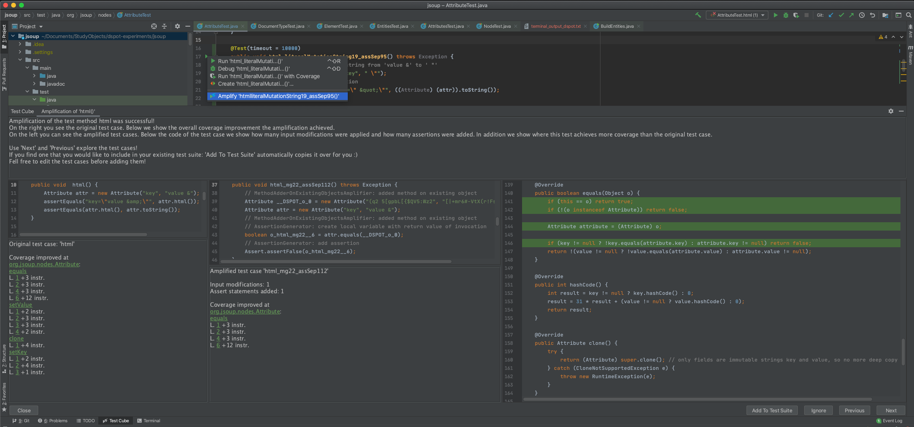

In this project, we investigate how we can help developers integrate amplified test cases into their test suite.
For this we plan to uncover what developers want to know about amplified test cases, explore different ways of visualizing information about the amplified cases within the IDE and study the acceptance of recommended amplified tests with developers.

### Test Amplification
The idea of test amplification is to create new tests by leveraging the knowledge within the existing test cases.
We are focussing on the amplification of JUnit test cases, powered by the [DSpot](https://github.com/STAMP-project/dspot) amplification tool.

Even though DSpot is fully automatic, at the end developers have to inspect, understand and maintain the amplified test cases.
We want to help them decide which amplified test cases are valuable for their project and use visualizations to help them understand the differences between test cases, as well as how their system works as a whole 😄

## Step 1: Learning About What Motivates Developers to Test & How They Judge Test Cases
Our goal is to support developers by improving their test suite.  
Though, what even is a "better" test suite for a developer?  
What do they want to improve in their test suite?  
Where could amplification support developers & what information should we show them to convince them of amplified test cases?  

To understand more about the motivations of developers when it comes to testing, we are surveying and interviewing a wide range of developers that write test cases.  
**Do you want to join & tell us what motivates you to write test cases?**  
We would like to hear from you over a digital coffee! [→ write Carolin an e-mail!](mailto:c.e.brandt@tudelft.nl?subject=[TestShift]%20Testing%20Motivation%20Interview)  
Alternatively you can fill out our online survey: [Link](https://research-survey.ewi.tudelft.nl/index.php/871464?lang=en)

## Step 2: Amplifying JUnit Tests within IntelliJ - Test Cube Plugin
To integrate amplification into the development process we created an IntelliJ Plugin that amplifies your test cases without leaving your IDE!
Find out more about the [Test Cube Plugin](https://github.com/TestShiftProject/test-cube) or install it from the [JetBrains Marketplace](https://plugins.jetbrains.com/plugin/14678-test-cube).

<iframe frameborder="none" width="230px" height="110px" src="https://plugins.jetbrains.com/embeddable/card/14678"></iframe>

<iframe frameborder="none" width="245px" height="48px" src="https://plugins.jetbrains.com/embeddable/install/14678"></iframe>

[Write us](mailto:c.e.brandt@tudelft.nl?subject=[TestShift]%20Test%20Cube%20Plugin%20Feedback) if you have any ideas / issues / feature requests!

## Step 3: Visualizing & Informing About Amplified Test Cases
In our next step, we will extend the Test Cube Plugin to provide useful insights about the amplified test cases & visualizations to help you understand easier what is going on.

## Step 4: Studying the Impact of Test Amplification Visualization
To investigate whether the visualizations of Test Cube indeed help developers improve their tests, we plan to perform controlled experiments as well as industrial field studies.  
Wanna be a part of it and see research live in action? 😊 [Tell us.](mailto:c.e.brandt@tudelft.nl?subject=[TestShift]%20Joining%20Evaluation%20Studies)
